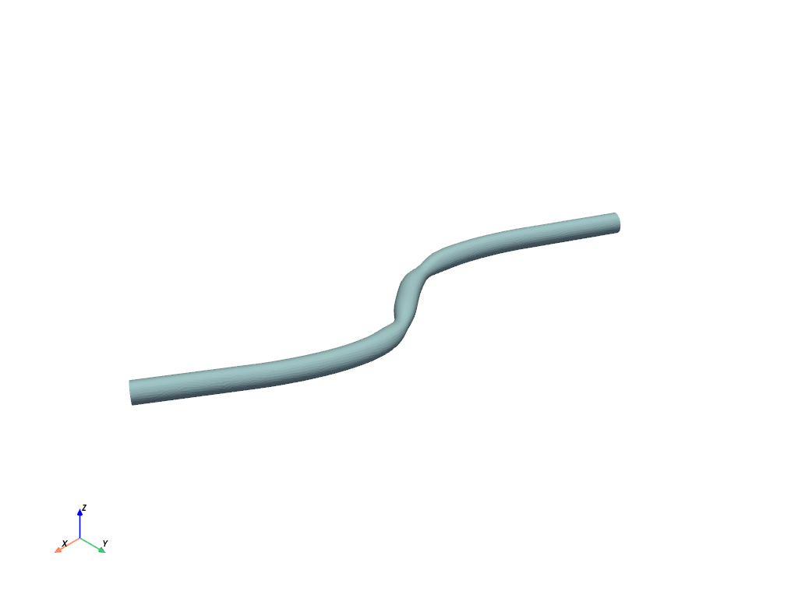
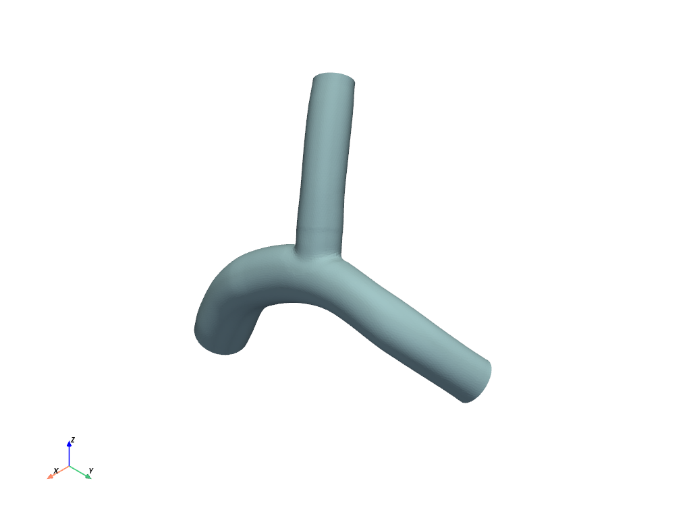

# geometric-algebra-transformer-gatr

- [Run the Notebook on Colab](https://colab.research.google.com/drive/13MHylFSD-PA3t1F27Eg8NVC0YimZt-F3?authuser=2)
- [Read the Report](Report.pdf)

## Results:

Novel models -> EquiLSTM and BiEquiLSTM -> Perfect 100% F1 score, over 90+% reduction in Memory footprint

This work investigated Projective Geometric Algebra (PGA) for 3D object classification using deep learning. We focused on classifying complex 3D geometries, specifically vascular structures.  

- A key innovation was the development of novel EquiLSTM and BiEquiLSTM models. These models combine the power of PGA for geometric representation with LSTM networks, known for handling sequential data. 
- The result? Perfect F1-scores of 100% for both models!  
- Even more impressive, these models achieved this remarkable accuracy with exceptional memory efficiency of more than 90% reduction in Memory Footprint (as low as 0.009 MB and 0.014 MB, respectively) and a minimal number of parameters (as low as 2.3K and 3.4K, respectively). 
- This translates to faster training times and the ability to run on devices with limited resources.

To understand the importance of specific components within our models, we conducted ablation studies using EquiLinear and BiEquiLinear models. These simpler models, built on the principles of equivariant operations in the context of geometric algebra, still achieved impressive F1-scores of over 96%. This highlights the effectiveness of even basic equivariant operations in geometric deep learning.

We also implemented the Geometric Algebra Transformer (GATr) architecture, which utilizes PGA representations and equivariant operations, achieving a 100% F1-score as well.

Overall, the proposed models performed significantly well while maintaining exceptional memory efficiency and compact model sizes. This work emphasizes the value of incorporating geometric algebra representations and equivariant operations in deep learning models for geometric processing tasks.

## Overview:

In recent years, two very important and popular research areas in Deep Learning have been:

- How can symmetries be encoded using equivariant deep learning?
- How can geometric objects be represented through algebraic structures?

So in this project, we cover both of these. Additionally, we check both the Geometric Operations and the Symmetries that they respect the Equivariant Properties of Projective Geometric Algebra (PGA) -> Pin(3,0,1) and Spin.

These two figures below are the fundamentals of the whole project. One is the `Architecture` and the other is the `Embedding` of Multi Vectors and Transformations (Rotations, Reflections, Translations) in Projective Geometry Algebra Pin(3,0,1).

The GATr (Geometric Algebra Transformer) architecture is designed to process geometric data represented as multivectors in the projective geometric algebra $\mathcal{G}_{3,0,1}$. It leverages the properties of geometric algebra, such as the geometric product and equivariance to the Euclidean group E(3), to capture and process geometric relationships and transformations in the input data.

## 1. Data Preprocessing

Before feeding the data into the GATr network, it needs to be preprocessed and embedded into multivectors of $\mathcal{G}_{3,0,1}$. This process involves the following steps:

1. **Geometric Type Extraction**: If necessary, raw inputs are preprocessed into geometric types, such as points, lines, planes, or other geometric objects.
2. **Multivector Embedding**: The geometric objects are embedded into multivectors of the projective geometric algebra $\mathcal{G}_{3,0,1}$ following the recipe described in Table 1 of the paper/above.

Table 1 specifies how common geometric objects and transformations are mapped to multivectors in $\mathcal{G}_{3,0,1}$. For example, a scalar $\lambda \in \mathbb{R}$ is embedded as $\lambda$, a plane with normal $n \in \mathbb{R}^3$ and origin shift $d \in \mathbb{R}$ is embedded as $d + n$, and a rotation expressed as a quaternion $q \in \mathbb{R}^4$ is embedded as $q_0 + q_1 e_1 + q_2 e_2 + q_3 e_3$.

Furthermore, the first class of the dataset used in this notebook includes idealized arteries with a single outlet and randomly located stenoses. The second class contains bifurcating arteries as shown in the figure 2 below.

| Single Outlet      | Bifurcating |
| ----------- | ----------- |
| | |
Figure 2

| Single Outlet      | Bifurcating |
| ----------- | ----------- |
| | |
Figure 2

## 2. GATr Network Architecture

The embedded multivector-valued data is then processed using the GATr network, which consists of $N$ transformer blocks. Each transformer block comprises the following components:

The GATr architecture comprises a combination of the following layers/modules:

**Note: change the formulae later**

## 1. EquiLinear Layer

The EquiLinear layer is a linear transformation that preserves the geometric structure of the input multivectors in the Projective Geometric Algebra (PGA) $\mathcal{G}_{3,0,1}$.

Any linear map $\phi : G_{d,0,1} \to G_{d,0,1}$ equivariant to the Pin(d,0,1) group can be expressed as:

$$
\phi(x) = \sum^{d+1}_{k=0} w_k \langle x \rangle_k + \sum^{d}_{k=0} v_k e_0 \langle x \rangle_k
$$

where:

- x: Input multivector.
- $w_k \in R^{d+2}$, $v_k \in R^{d+1}$: Learnable parameters.
- $\langle x \rangle_k$: Blade projection of x, setting all elements except grade-k to zero.
- $e_0$: Homogeneous basis vector.

The matrix $w_k$ and $v_k$ are learned during the training process and ensures that the linear transformation preserves the geometric properties of the input multivectors.

## 2. EquiLayerNorm Layer

The EquiLayerNorm layer performs $E(3)$-equivariant layer normalization on multivector inputs while preserving the geometric structure and E(3) equivariance, defined as:

$$
\text{LayerNorm}(x) = \frac{x}{ \sqrt{ \mathbb{E}_c\langle x, x\rangle }}
$$

where the expectation $\mathbb{E}c$ is taken over the channel dimension, and $\langle \cdot, \cdot \rangle$ denotes the invariant inner product of $\mathbb{G}{3,0,1}$.

This layer normalization operation ensures equivariance by normalizing each multivector in the input tensor separately, using the invariant inner product to compute the normalization factor.

This implies $\mathbb{E}_c ||\text{inputs}||^2 = 1$.

## 3. Geometric Attention

The Geometric Attention module is an adaptation of the self-attention mechanism used in transformers, but it operates on multivector inputs in $\mathcal{G}_{3,0,1}$. It computes the attention scores and output multivectors while preserving the geometric structure and E(3) equivariance.

For input multivectors, the Geometric Attention computes the output multivectors as:

$$
\textbf{Attention(q,k,v)} = \sum_i \textbf{Softmax}_i \frac{\sum_c \langle q_i, k_i \rangle}{\sqrt{8 n_c}}v_i
$$
where the expectation is over the channel dimension

## 4. Equivariant Geometric Bilinears

In the context of GATr and PGA, equivariant linear maps alone are not sufficient to build expressive networks. To enable the construction of new geometric features from existing ones and to enhance the representational power of the network, two additional geometric primitives are introduced: the **geometric product** and the **join operation**.

1. **Geometric Product**

The geometric product, denoted by $x, y \rightarrow xy$, is the fundamental bilinear operation in geometric algebra. It allows for substantial mixing between grades, enabling the network to combine geometric entities in a meaningful way. For instance, the geometric product of vectors consists of scalar and bivector components, capturing essential geometric information.

The geometric product is equivariant, as shown in Appendix A of the paper. Its inclusion in the network architecture is crucial for expressivity and the ability to represent complex geometric relationships.

2. **Join Operation:**

The second geometric primitive used in GATr is derived from the join operation, denoted by $x, y \rightarrow (x^* \wedge y^*)^*$. While the notation may appear complicated, the join operation plays a simple role in the architecture: it provides an equivariant map that involves the dual operation, $x \rightarrow x^*$.

Including the dual operation is essential for expressivity in the $\mathbb{G}_{3,0,1}$ algebra (the algebra of 3D Euclidean space). **Without dualization, it is impossible to represent even simple functions like the Euclidean distance between two points**, as shown in Appendix A of the paper.

However, the dual operation itself is not $\text{Pin}(3,0,1)$-equivariant (with respect to the $\rho$ representation).

To make the $\text{EquiJoin}$ operation equivariant to mirror transformations as well, the authors multiply its output with a pseudoscalar derived from the network inputs, resulting in the following expression:

$$
x, y, z \rightarrow \text{EquiJoin}(x, y; z) = z_{0123} (x^* \wedge y^*)^*
$$

Here, $z_{0123} \in \mathbb{R}$ is the pseudoscalar component of a reference multivector $z$ (see Appendix B for details). This operation ensures equivariance to even (non-mirror) transformations.

3. **Geometric Bilinear Layer:**

The geometric product and the $\text{EquiJoin}$ operation are combined in a geometric bilinear layer, denoted by $\text{Geometric}(x, y; z)$, which is defined as:

$$
\text{Geometric}(x, y; z) = \text{Concatenate}_{\text{channels}}(xy, \text{EquiJoin}(x, y; z))
$$

This layer concatenates the results of the geometric product and the $\text{EquiJoin}$ operation along the channel dimension, providing a rich representation of geometric features and relationships.

By incorporating the geometric product and the $\text{EquiJoin}$ operation, the GATr architecture gains the ability to construct new geometric features from existing ones, capture complex geometric relationships, and achieve a higher level of expressivity in representing and processing geometric data. These geometric bilinears form a crucial component of the GATr framework, enabling it to leverage the powerful formalism of Projective Geometric Algebra (PGA) for equivariant geometric deep learning tasks.

## 5. Residual Connection

The Residual Connection is a skip connection that adds the input multivector to the output of a layer or module. For an input multivector $x$ and a layer or module output $y$, the residual connection computes the output $z$ as:

$$
z = x + y
$$

Residual connections help alleviate the vanishing gradient problem and facilitate the flow of information in deep neural networks.

## 6. Gated GELU/ReLU for Multivectors

In the paper, the authors proposed the use of scalar-gated GELU nonlinearities for multivectors. This nonlinearity is defined as:

$$
\text{GatedGELU}(x) = \text{GELU}(x_1) x
$$

where $x_1$ is the scalar component of the multivector $x$. This gating mechanism utilizes the scalar component of the multivector to control the activation of the entire multivector.

This way of implementing GELU is also valid for other similar activation functions, such as ReLU as thus:

$$
\text{GatedReLU}(x) = \text{ReLU}(x_1) x
$$

This cell below inplements both the two nonlinearities.

## 7. Output Extraction

After processing the multivector-valued data through the GATr network, the target variables (e.g., scalar, vector, bivector, trivector, or pseudoscalar outputs) are extracted from the output multivectors. The extraction process follows the mapping described in Table 1 above, which specifies how different geometric objects and transformations are embedded into $\mathcal{G}_{3,0,1}$.

In the code in later sections, we extracted only the vectors ($e_0, e_1, e_2, e_3$ -- grade 1) for the last classifier layer because they correspond to planes and symmetries (rotations, translations, and reflections) in 3D.

The GATr architecture is designed to process geometric data in a way that respects the geometric structure of the input, potentially improving performance on tasks involving geometric reasoning and manipulation.